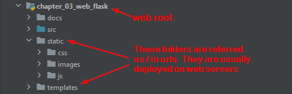

# Flask Web Application Container

[Flask](https://pypi.org/project/Flask/) is a lightweight web app container. 
It delegates HTTP requests through [Werkzeug](https://palletsprojects.com/p/werkzeug/)
to our code and use [Jinja2](https://pypi.org/project/Jinja2/) as response template.

We can run Flask for development, and wrap it in a [WSGI](https://wsgi.readthedocs.io/en/latest/) 
server, such as
[gunicorn](https://gunicorn.org/)
or [uWSGI](https://uwsgi-docs.readthedocs.io/en/latest/),
for production(to handle multithreading/multi-process).

Tornado is simple, but need more knowledge for multi-threading.
Django has relatively higher learning curve. 
Other web servers can be found [here](https://steelkiwi.com/blog/top-10-python-web-frameworks-to-learn/),
and [here](https://scoutapm.com/blog/the-most-popular-python-web-frameworks-in-2020),
such as CherryPy and FastAPI.

Document: 
- https://flask.palletsprojects.com/en/1.1.x/

Tutorials:
- https://hackersandslackers.com/your-first-flask-application/
- https://www.tutorialspoint.com/flask/index.htm
- https://www.javatpoint.com/flask-tutorial
- https://flask.palletsprojects.com/en/1.1.x/tutorial/
- https://exploreflask.com/en/latest/views.html
- https://testdriven.io/courses/learn-flask/sessions/
- https://pypi.org/project/Flask-Injector/
- https://www.tutorialspoint.com/flask/flask_sessions.htm
- https://www.geeksforgeeks.org/python-introduction-to-web-development-using-flask/
- http://zetcode.com/python/flask/
- https://www.softwaretestinghelp.com/python-flask-tutorial/
- https://blog.tecladocode.com/handling-the-next-url-when-logging-in-with-flask/

Books:
- Flask Web Development, 2E

## HTTP Basics

[HTTP](https://en.wikipedia.org/wiki/Hypertext_Transfer_Protocol) is part of the core 
internet foundation as the ommunication protocol. 

Here are the common aspects that we have on a daily bases:
- request methods, such as GET, POST
- request parameters and encoding
- request headers

Here are some tutorials:
- https://developer.mozilla.org/en-US/docs/Web/HTTP
- https://www.tutorialspoint.com/http/index.htm
- https://www3.ntu.edu.sg/home/ehchua/programming/webprogramming/HTTP_Basics.html

## HTML

[HTML](https://html.spec.whatwg.org/) is the document format in the WWW world, 
[wiki](https://en.wikipedia.org/wiki/HTML). It's GUI description language.

Here are some tutorials:
- https://www.w3schools.com/html/
- https://developer.mozilla.org/en-US/docs/Web/HTML

Most modern web sites are using [javascript](https://en.wikipedia.org/wiki/JavaScript)
to generate HTML DOM tree. Popular javascript frameworks include
[Vue.js](https://vuejs.org/), [React.js](https://reactjs.org/), and 
[Angular.js](https://angularjs.org/). Others are mentioned 
[here](https://www.lambdatest.com/blog/best-javascript-framework-2020/)

[CSS](https://en.wikipedia.org/wiki/CSS) is used for decoration styles.

Javascript and CSS are separate topics.

## Flask Application Setup
We need to map url resources to one of the following:
- static files: css, javascript, images, etc.
- dynamic templates.
- Python code for request handling and dynamic content generating.



It's not a good idea to leave the Python code in the url accessible
folder. Generally, we put static files on a web server, such as Nginx,
and put templates and Python code on the Flask server behind the
web server. To avoid confusion, we call Nginx web server and Flask
web app server, or simply app server.

When we start the Flask server in dev, we have to start from the
web root folder in order to serve static content.

Here is the setup in the Python code(src/flask_test_app/web_main.py):

```
from flask import Flask, render_template, request

app = Flask(__name__, template_folder='templates', root_path='.', static_folder="static")

@app.route('/')  
def root():
    return "Hello, world"
    
# start web app
if __name__ == '__main__':
    app.run(debug=True)
```

We specify the root folder and others in the app object.

The default port is 5000, we may change that with
```port=8888``` in the ```app.run()```

## URL routing
URLs are the interface for user to submit requests. They are routed by Flask
to our handler logic via annotation @app.route() like the above.

src/flask_test_app/web_main.py lists several ways to deal with requests:
- Using template with dynamic data (/hello)
- Using template with dynamic structure (/pokemon/<<int:num>>)
- GET/POST methods ()
- HTML form (/length)
- parameters in url (/pokemon/<<int:num>>)

src/flask_test_app/web_handlers.py shows
- streaming data: https://www.fullstackpython.com/websockets.html
  
- file upload: see [this simple example](https://pythonbasics.org/flask-upload-file/),
  [this good post](https://blog.miguelgrinberg.com/post/handling-file-uploads-with-flask),
  and [streaming](https://stackoverflow.com/questions/62552660/how-to-forward-http-range-requests-using-python-and-flask).

Generally, we put handler logic in separate files for better code
structure. In the file src/flask_test_app/web_handlers.py, 

```
from flask import Response, stream_with_context, Blueprint

stream_urls = Blueprint('url', __name__, static_folder="static", template_folder='templates')

```

Then we can include all handler method with @app.route in this file
to the web_main.py:

```
import flask_test_app.web_handlers as web_handlers
app.register_blueprint(web_handlers.stream_urls)
```

HTTP redirect is discussed 
[here](https://stackoverflow.com/questions/14343812/redirecting-to-url-in-flask),
[here](https://stackoverflow.com/questions/54690994/how-to-send-post-request-using-flask-redirect),
[here](https://stackoverflow.com/questions/15473626/make-a-post-request-while-redirecting-in-flask/15480983#15480983),
and [here](https://softwareengineering.stackexchange.com/questions/99894/why-doesnt-http-have-post-redirect).
However, these discussions suggest that we should redirect POST, though
technically we can do so by set code to 307 in the redirect method.

Basically, we can redirect requests like this:

```
flask.redirect(flask.url_for('operation', new_param=value, **request.args))
```

Redirect does not carry request parameters, so we have to do it manually.
This is because the redirect request is a new request. Clients can see the
url change because the redirect response reaches clients.

Redirect is useful in several cases, e.g., when a user hits a page where login
is required we can redirect the user to the login page.

Redirect tells browser to initiate a new request to the new url.

In Java, there is also a url forward but seems Flask does not have it.
See [here](https://www.baeldung.com/servlet-redirect-forward),
[here](http://www.differencebetween.net/technology/difference-between-forward-and-redirect/),
[flask-http-forwarding](https://github.com/casetext/flask-http-forwarding),
and [Flask-Forward](https://pythonhosted.org/Flask-Forward/).

[Difference between redirect and forward](http://www.differencebetween.net/technology/difference-between-forward-and-redirect/)


## Error handling:  
Rather than catching errors in each handler, we can catch all with 
decorator @app.errorhandler(Exception). Create an AOP like method
and annotate it with this decorator.  
Inside the method, we may log errors, email errors, etc. Then return a
web page with proper details.

See references for more details:
- https://blog.miguelgrinberg.com/post/the-flask-mega-tutorial-part-vii-error-handling
- https://code-maven.com/python-flask-catch-exception
- https://stackoverflow.com/questions/60324360/what-is-best-practice-for-flask-error-handling

Message flashing in Flask is handy to pass out intermediate results.
This needs sessions, which in turn needs secret key. So set the secret key
right after app creation. In our example, we flash messages out in /bye and
error handler and capture it in error.html (This is just for illustration
purpose). In production, we should handle all messages with same method's
template.

See references for more details:
- https://flask.palletsprojects.com/en/1.1.x/patterns/flashing/
- https://cs.wellesley.edu/~cs304/lectures/flask/activities-3.html

## HTTP Sessions and Cookies
[HTTP sessions](https://stackoverflow.com/questions/3804209/what-are-sessions-how-do-they-work) 
send [cookies](https://en.wikipedia.org/wiki/HTTP_cookie) to client browsers.

Thought cookies have size limit 4K, we could store many client data in cookies, 
such as username. Shopping carts may not fit.
However, for security reason, we want to leave only the client identifier
in cookies and store client data on server side. This identifier is the
session ID, and we are going to encrypt it for data security.

We should use HTTPS as well. If the cookie is stolen, we can remove it on
the server side.

### Session ID and Encryption
We could use unique user name or generate a random number as session id.

Set app.secret_key will trigger Flask to encrypt cookies.

### Server Side Session Storage
We could use a local cache to store session data. However, it's not going to
work when we have more than one server to serve requests if we don't have a
session-sticky load balancer. So we need a shared storage across all servers.

We could write our lib to handle session storage - 
implement flask.sessions.SessionInterface. However, there is a lib already,
[flask_session](https://github.com/fengsp/flask-session) with the doc
[flask_session_doc](https://flask-session.readthedocs.io/en/latest/).

For illustration purpose, we use filesystem as the storage. This is fine
in dev. In production, redis or others are preferred. 

The flask-session set up is

```
app.secret_key = 'I am secret'  
app.config['SESSION_TYPE'] = 'filesystem'
# app.config['SESSION_FILE_DIR'] = 'my_folder'  # default to flask_session
Session(app)
```

The usage is like this:

```
@stream_urls.route('/session_set')
def session_set():
    session['key'] = 'value'
    return 'ok'

@stream_urls.route('/session_get')
def session_get():
    return session.get('key', 'not set')
```

In FireFox, go to upper right corner menu, then web developer | storage inspector.
We should see the cook we just set.

To use redis as the storage, we need to do the 
[following](https://stackoverflow.com/questions/44769152/difficulty-implementing-server-side-session-storage-using-redis-and-flask):

```
app.config['SESSION_TYPE'] = 'redis'
app.config['SESSION_REDIS'] = redis.from_url('127.0.0.1:6379')

sess = Session()
sess.init_app(app)
```

More details:
- https://www.javatpoint.com/flask-session
- https://www.valentinog.com/blog/cookies/
- https://blog.paradoxis.nl/defeating-flasks-session-management-65706ba9d3ce
- https://hackersandslackers.com/managing-user-session-variables-with-flask-sessions-and-redis/
- https://github.com/hackersandslackers/flask-session-tutorial

## WSGI Integration
Both gunicorn and uwsgi won't run on windows, because they use sys/socket 
underneath, this is a *nix lib. So install them with cygwin or win10 bash on windows.
Note that uwsgi install
```pip install uwsgi```
requires compilation, it needs dependent libs installed. Sometimes, we don't have
permission to do so, such as in cloud environment. So we are going to use conda
installation
```conda install -c conda-forge uwsgi```.
This works for Linux and Mac. Use ```uwsgi --version``` to validate the installation.

There is also a python package pyuwsgi in pypi.

gunicorn installation is simple without compilation ```pip install gunicorn```.

For now, we use Linux/CentOS. There are 2 scripts here to start uwsgi and gunicorn. 

Another option is [Waitress](https://docs.pylonsproject.org/projects/waitress/en/latest/),
which runs on windows, linux, and mac.

We leave out Nginx web server because it's not python related. The full picture should be


[Here](https://chriswarrick.com/blog/2016/02/10/deploying-python-web-apps-with-nginx-and-uwsgi-emperor/)
shows how to integrate all 3: nginx + uwsgi + flask.

Flask is simple because it pushes the multi-processing logic to WSGI containers.
In contrast, Tornado is complex because it mixes web handler code with the multi-processing
code. Which tool to use depends on scenarios.

These servers have configuration files for more options, please check their documents.
 
References:
- https://www.digitalocean.com/community/tutorials/how-to-set-up-uwsgi-and-nginx-to-serve-python-apps-on-centos-7
- https://uwsgi-docs.readthedocs.io/en/latest/
- https://docs.gunicorn.org/en/stable/settings.html
- https://docs.pylonsproject.org/projects/waitress/en/stable/
- https://quintagroup.com/cms/python/web-server

## Testing
https://flask.palletsprojects.com/en/1.1.x/api/#flask.Flask.test_client

## HTML to PDF
Sometimes, there is a need to convert the output from HTML to PDF.
Here are some references using pdfkit lib and WkHTMLtoPDF:
- https://pythonpedia.com/en/knowledge-base/28165704/convert-html-to-pdf-using-python-flask

## Flask Security

https://blog.nvisium.com/injecting-flask
https://martinfowler.com/articles/session-secret.html


