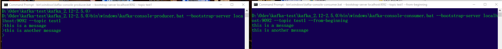
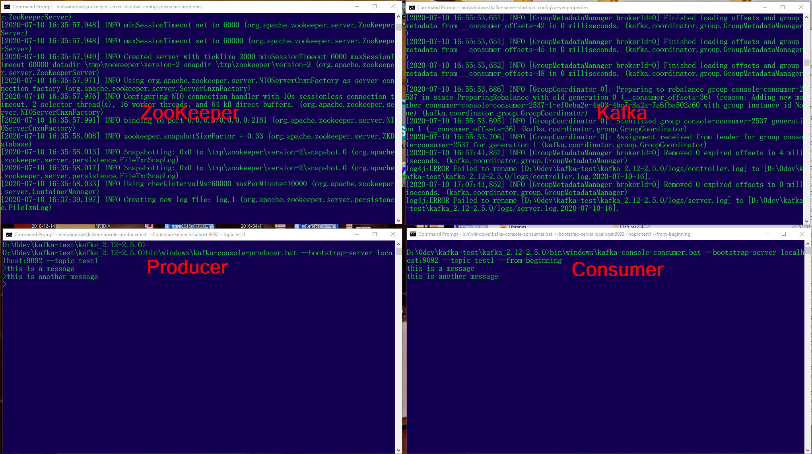
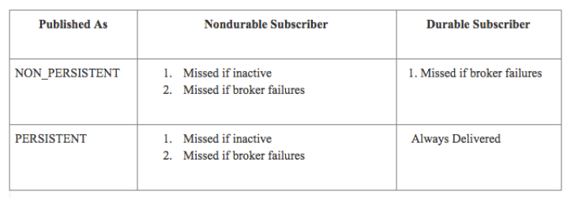

# Kafka Infrastructure

check the official doc: https://kafka.apache.org/quickstart

## Kafka Server Setup
Download and unzip: https://www.apache.org/dyn/closer.cgi?path=/kafka/2.5.0/kafka_2.12-2.5.0.tgz
Assume $KAFKA_HOME is the parent of the bin folder

### ZooKeeper
New command window
Go to $KAFKA_HOME
Start ZooKeeper:
```bin\windows\zookeeper-server-start.bat config\zookeeper.properties```

Near the end of the console log, look for this:
```[2020-07-10 16:35:57,991] INFO binding to port 0.0.0.0/0.0.0.0:2181 (org.apache.zookeeper.server.NIOServerCnxnFactory)```

### Kafka Server
New command window
Go to $KAFKA_HOME
Start Kafka:
```bin\windows\kafka-server-start.bat config\server.properties```

Near the end of the console log, look for this:
```[2020-07-10 16:37:41,625] INFO Registered broker 0 at path /brokers/ids/0 with addresses: ArrayBuffer(EndPoint(DESKTOP-SI2JDHV.fios-router.home,9092,ListenerName(PLAINTEXT),PLAINTEXT)),```

## Topics
New command window
Go to $KAFKA_HOME
Next, we show all topics(empty), then create a topic called test1, then show all topics again(test1)
```D:\0dev\kafka-test\kafka_2.12-2.5.0>bin\windows\kafka-topics.bat --list --bootstrap-server localhost:9092```


```D:\0dev\kafka-test\kafka_2.12-2.5.0>bin\windows\kafka-topics.bat --create --bootstrap-server localhost:9092 --replication-factor 1 --partitions 1 --topic test1```
```Created topic test1.```

```D:\0dev\kafka-test\kafka_2.12-2.5.0>bin\windows\kafka-topics.bat --list --bootstrap-server localhost:9092```
```test1```

```D:\0dev\kafka-test\kafka_2.12-2.5.0>```

Now reuse this windows as message producer:
```bin\windows\kafka-console-producer.bat --bootstrap-server localhost:9092 --topic test1```
At the > prompt start typing messages


New command window
Go to $KAFKA_HOME

```D:\0dev\kafka-test\kafka_2.12-2.5.0>bin\windows\kafka-console-consumer.bat --bootstrap-server localhost:9092 --topic test1 --from-beginning```




So we end up with 4 windows:



## Python Kafka Client

Install with pip: pip install kafka
Install with conda: conda install kafka
API doc is: https://pypi.org/project/kafka-python/
API is simple, but need background knowledge on messaging.

There are 2 types of channels/destinations in JMS:
Topic - 1-to-many broadcast
Queue - 1-1 or point to point commnication.

Kafka Topic is really channel in JMS context. Whether it's a Topic or Queue in JMS depends on Consumer Group.

Good introduction on Kafka is:
https://www.cloudkarafka.com/blog/2016-11-30-part1-kafka-for-beginners-what-is-apache-kafka.html
https://www.confluent.io/blog/exactly-once-semantics-are-possible-heres-how-apache-kafka-does-it/
https://www.baeldung.com/kafka-exactly-once
https://blog.softwaremill.com/7-mistakes-when-using-apache-kafka-44358cd9cd6

Transaction and global transactions (GTX) - cross Messaging and database, e.g..
Autocommit or not.

Topic properties:
Durable
Temp

Message:
Persistent
Headers



Poison messages - cause consumer failures so it is never removed from channel/destination, then re-dispatched again and end up with infinite loop

Message grouping - e.g., group all transaction events for a trade.

Encryption
SSL


Commercial vendors:
Tibco
IBM MQ
AWS MQ

Open Source:
ActiveMQ
RabbitMQ
ZeroMQ

Distributed applications:
First rule: https://martinfowler.com/articles/distributed-objects-microservices.html
Second rule: granularity counts - monolith, macroservices, microservices
https://martinfowler.com/articles/microservices.html
Third rule: Hide it

https://www.toutiao.com/a6867544958019043843/

[Celery](https://github.com/celery/celery) is like JMS interfaces, needs backend brokers.
