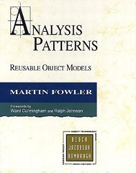
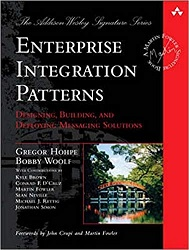

### Design Patterns

The design principles are somewhat vague to apply in real cases. Design patterns
are code examples of demonstrating how to apply these principles in real world.
They are code stabilizers or extenders. They serve as blockers to prevent change 
spilling. Sometimes, we call them firewalls to prevent fire(changes in this case) 
from spreading out.

If we contain the changes to a smaller scope, then the cost and effort would be
smaller.

To better understand design patterns, we could trace them back to design 
principles to see which principles they apply, and so we have a better 
understanding of the underlying logic. Without full understanding and blindly
applying a pattern leads to no benefit, or even chaos in some cases.

#### GoF 24 patterns
___
[Design Patterns](https://en.wikipedia.org/wiki/Design_Patterns) is still the
bible in the field.

 

sourced from https://en.wikipedia.org/wiki/Design_Patterns.

#### Analysis Patterns
___
This is another equally best book, authored by 
[Martin Fowler](https://martinfowler.com/books/ap.html), who is one of the
gurus in the industry. 

sourced from https://martinfowler.com/books/ap.jpg

He has another popular book: 
[Refactoring](https://martinfowler.com/books/refactoring.html)

Another note on [recurring](http://martinfowler.com/apsupp/recurring.pdf)
is a good design example.

#### Enterprise Integration Patterns
___
[EIP](https://www.enterpriseintegrationpatterns.com/) is exceptional too.

sourced from amazon.

Spring framework implements the patterns in this book in spring-integration.

[Design Idioms](design_idioms.md)
