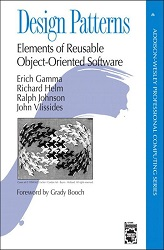

### Design Patterns

The design principles we discuss are somewhat vague and out of blue. So design
patterns are recorded with code examples from practice.

#### GoF 24 patterns
___
[Design Patterns](https://en.wikipedia.org/wiki/Design_Patterns) is still the
bible in the field.

 

sourced from https://en.wikipedia.org/wiki/Design_Patterns.

#### Analysis Patterns
___
This is another equally best book, authored by 
[Martin Fowler](https://martinfowler.com/books/ap.html), who is one of the
gurus in the industry. 

sourced from https://martinfowler.com/books/ap.jpg

He has another popular book: 
[Refactoring](https://martinfowler.com/books/refactoring.html)

Another note on [recurring](http://martinfowler.com/apsupp/recurring.pdf)
is a good design example.

#### Enterprise Integration Patterns
___
[EIP](https://www.enterpriseintegrationpatterns.com/) is exceptional too.

sourced from amazon.

Spring framework implements the patterns in this book in spring-integration.

[Design Idioms](design_idioms.md)
