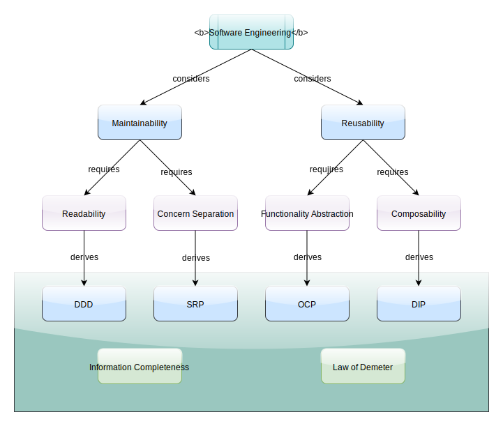

### Design Principles
With all code containers(functions, classes/modules, packages, libraries),
we need to take care of 2 aspects:
- the interface we provide to users
- the dependencies we use in the implementation

The interface we provide to users is the dependency of callers. So this is
a game of dependency management. How do we divide the code into containers?
There is no difference where we put the code, 2 extremes are:
- we put all code in one file(container)
- we put one line in one file and have many files.

So in order to design better to meet the aspects of design, we have to dig
deeper. Here are some principles summarized by pioneers from their experience.
Below chart extends the previous chart.

There are 4 fundamental design principles.

#### OCP - Open Closed Principle
___
[OCP](https://en.wikipedia.org/wiki/Open%E2%80%93closed_principle) is short for
"open for extension and closed for modification". It has 2 parts, "open for
extension" and "closed for modification". For the first part, it's similar to
road construction where we pave a new lane next to existing lanes. It's likely
we are not going to touch the existing lanes and merely extend with more lanes.
So the key is to build the new feature with **minimal** touch of existing code.

The second part, "closed for modification", says that when we make internal fixes
the code change should not propagate to outside. For example, when we retrieve
data from a SQL database in a DAO class, if the database connection or SQL 
queries are on the method interface, then this method is not stable if we
expect that we could change the data source to Elastic Search, which is JSON
based, or a file. So a better way to keep these unstable factors out of the
method signature.

Another aspect is "Don't get into the way". If we extend a functionality for
some reason, the existing non-satisfying functionalities do not add barriers.
In other words, implementation details do not "leak" out.

#### SRP - Single Responsibility Principle
___
[SRP](https://en.wikipedia.org/wiki/Single-responsibility_principle) is saying
that components should have one feature and thus has only one reason to change.

There are several ways to get hints to refactor the code to comply with SRP.
For example, if you have a method depends on another class, and you actually
use only 1/3 of all public methods in that class, then it would better if you
split the other class into 2 classes so that you use all methods in one of
the splits and none in the other. This is related to
[ISP](https://en.wikipedia.org/wiki/Interface_segregation_principle)
The split of the class makes the split classes single responsible (If they
are not, split them further).

Another example is to look at the change frequency of code. If some changes
more frequently than others, then a refactoring is due.

#### DIP - Dependency Inversion Principle
___
[DIP](https://en.wikipedia.org/wiki/Dependency_inversion_principle) is also
known as [IoC](https://en.wikipedia.org/wiki/Inversion_of_control). It says
that concrete implementations depend on abstractions, not the other way
around. One corollary from this is that the shorter paths of packages is 
more abstract, the longer paths is more concrete. In other words, if we
take out the sub packages of longer paths, the abstraction with shorter paths
should have no break (may have feature reductions, but no break). So
abstraction is more stable.

#### DDD - Domain Driven Design
___
[DDD](https://en.wikipedia.org/wiki/Domain-driven_design) is really not a 
design principle, it's a methodology. In a word, don't speak 
[Martian](https://lparchive.org/Master-of-Orion/Update%2003/3-BTL4tpX.png).
In Chinese, 讲人话.
https://blog.csdn.net/u012562943/article/details/107498542

It emphasizes that all interfaces for class and methods should be as close
as possible to the business domain language.

In general, business enhancements and technology upgrades evolve in different
directions and frequencies. We try to keep the architecture stable when
technology upgrades kick in. This approach will leave us to deal with only
architecture changes from business side.

In practice, we utilize DDD approach to create business domain models in 
packages with shorter paths, so they are more stable. When new business
requirements come in, OCP kicks in. When technology upgrades come in, there
should be no architectural changes. So in most cases, we deal with changes
with only 1 reason. If both come in, reschedule one of them to later.

### Information Management
The following 2 principles are about information flow, high cohesion and 
low coupling.
#### Law of Demeter
___
[Low of Demeter](https://en.wikipedia.org/wiki/Law_of_Demeter) is about
information hiding. In plain saying, do not know your neighbour's neighbour.
For example, don't do m.n.p() because p() is a method of n that m should
not know.

#### Information completeness
___
We should keep all code relate to a feature as close as possible. Otherwise,
it takes more time to get the full picture. One example was Java JPA 1.0,
which broke SQL queries into 2 places. Spring JPA fixed it. Then JPA was
fixed too.

Sometimes, we need to create bi-directional references for information that
cannot be tracked in IDEs. Time to find where we should make the change is
much longer than the time to actually change the code.

### Afternote
There is a popular acronym [SOLID](https://en.wikipedia.org/wiki/SOLID) for
5 principles. I feel hesitate to agree with one of them belonging to the same 
group, 
[Liskov Substition Principle](https://en.wikipedia.org/wiki/Liskov_substitution_principle).
This principle applies only to class inheritance context. The other four 
apply to a broader context, such as standalone functions in Python.
In Python, a module file with functions inside is similar to classes. So I
feel like we mix 4 cats with a dog.

In practice, we may bend these rules a bit, but don't break them if possible.
Otherwise we may pay more cost later at certain point. Balance among trade-offs
should be made sensitively. If the cost of doing it later <= now, then leave it
to the future. For example, if there is only 1 implementation for a feature,
there is no need to put an interface on top of the implementation. IDE can help
with that later on, such as extract the interface from implementation, change
the caller to the interface type, etc. So there is no point to do it now because
it's going to take the same amount of work later.

Under-engineering leads to hardened code - not easy to change later, i.e., 
future cost >> current cost. So it would be better to do partial or whole 
change now to save the total cost.

Over-engineering costs more unnecessarily. This happens when we apply design
skills improperly.

[Design Patterns](design_patterns.md)
