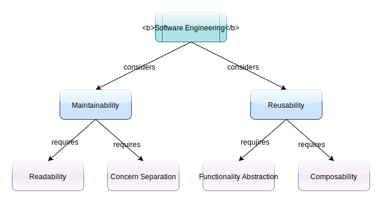

### Software Design and Architecture

[Software Design](https://en.wikipedia.org/wiki/Software_design) is discussed
in the context of 
[Software Engineering](https://en.wikipedia.org/wiki/Software_engineering).

There are 2 major considerations in software design:  
- [Maintainability](https://en.wikipedia.org/wiki/Maintainability)  
- [Reusability](https://en.wikipedia.org/wiki/Reusability) 
 
Other considerations, e.g., can be found here:
- https://courses.cs.vt.edu/~csonline/SE/Lessons/Qualities/index.html
- https://www.comp.nus.edu.sg/~damithch/guide3e/Ch11.html  
      

#### Maintainability
Software without maintenance is called abandonware. There is an infamous
internet post under the search "how to write unmaintainable code", e.g., 
https://www.doc.ic.ac.uk/~susan/475/unmain.html. It's similar to 
[Aircraft Maintanence](https://en.wikipedia.org/wiki/Aircraft_maintenance),
fly, maintain, fly, maintain, ... .

In general, code readability is very important for software written by more 
than 3 developers. Martin Fowler wrote in his Refactoring book, "**Any fool 
can write code that a computer can understand. Good programmers write code 
that humans can understand.**" We can't modify code without understanding.

Mixing 2 concerns together would make it harder to maintain, since when we 
modify code for one concern we have to make sure we don't break the other one.
This would require more testing as well. If we mix more concerns/aspects, then
we need to test more. So it would be better if we keep different concerns
separate.

#### Reusability
If we could reuse existing code, effectively we walk on 
[Stilts](https://en.wikipedia.org/wiki/Stilts). We build functionalities on
top of reusable components. These reusable components could be free or
commercial, or crafted by field experts, etc. It's coded once and reused
many times.

In order to make reusable code, we have to abstract details so that users
can understand the functionality without unfamiliar/unnecessary details.
So proper abstraction is essential, the abstraction decides how widely 
it can be reused. One counter example is the power outlets, we have so 
many types without abstraction due to historic reason. 

 

Abstraction is usually the stable points in the system. If there is no
stable point in a system, then any change in a system is system wide, i.e.,
the change propagates everywhere. So proper abstraction serves as gates
to stop changes from inside to outside. It is done through refactoring.
When the interface speaks in business language, you can see the beauty.

Composability means how we write code for others to call. How convenient
can they reuse our code? What requirements do they fill in before they
can use our code?

Another aspect of composability is that our code may be called 10K times 
per second (scalability), or chain calls in a certain way. 
Leaving an untested composition to users to find out is not pleasant.

We are going to discuss these aspects in more details next. 

[Software Principles](docs/design_principles.md)

We illustrate the content with 5 small examples. It's hard to find good 
examples. First, it needs to be small so that we know the requirements quickly. 
On the other hand, it needs to be complex enough to show the difference.

https://dzone.com/articles/21-object-oriented-and-system-design-problems-to-p
